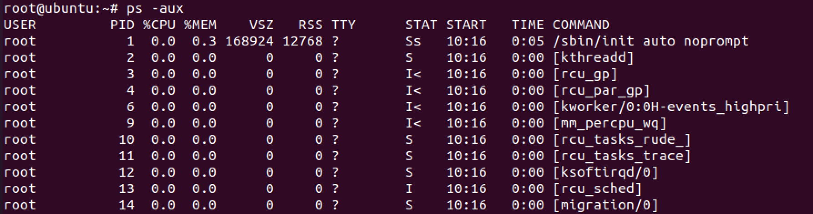

# Linux入侵排查
[toc]
## 账号安全

### 基本信息

1、用户信息文件/etc/passwd

```
root:x:0:0:root:/root:/bin/bash

account:password:UID:GID:GECOS:directory:shell

用户名:密码:用户ID:组ID:用户说明:家目录:登陆之后shell

注意：密码x只是一个占位符，真实密码信息存放在/etc/shadow文件中，无密码只允许本机登陆，远程不允许登陆
```


2、影子文件/etc/shadow

```
root:$6$oGs1PqhL2p3ZetrE$X7o7bzoouHQVSEmSgsYN5UD4.kMHx6qgbTqwNVC5oOAouXvcjQSt.Ft7ql1WpkopY0UV9ajBwUt1DpYxTCVvI/:16809:0:99999:7:::

用户名:加密密码:密码最后一次修改日期:两次密码的修改时间间隔:密码有效期:密码修改
到期到的警告天数:密码过期之后的宽限天数:账号失效时间:保留

注意：当加密密码字段为"*"(一般是系统用户)、"!"(表示用户被禁用)时表示该用户无法使用密码身份验证登录到系统。仍然允许使用其他登录方法，例如基于密钥的身份验证或切换到用户。当加密密码字段为"!!"时表示该用户从来没有设置过密码，如新建用户没有设置密码，也是不允许使用密码身份验证登录到系统。
```


### 用户登录信息

who -- 查看当前登录用户（tty本地登陆  pts远程登录）

```
haha     :0           2021-10-12 10:18 (:0)

haha     pts/2        2021-10-12 10:51 (172.16.34.1)
```


w -- 查看系统信息，想知道某一时刻用户的行为

```
 10:53:50 up 36 min,  2 users,  load average: 0.22, 0.15, 0.10
USER     TTY      来自           LOGIN@   IDLE   JCPU   PCPU WHAT
haha     :0       :0               10:18   ?xdm?   1:24   0.01s /usr/lib/gdm3/gdm-x-session --run-script env GNOME_SHELL_SESSION_MODE=ubuntu 
haha     pts/2    172.16.34.1      10:51    0.00s  0.03s  0.01s w
```


uptime -- 查看登陆多久、多少用户，负载

```
 10:54:40 up 37 min,  2 users,  load average: 0.34, 0.17, 0.11
```


lastlog -- 查看系统中所有用户最近一次登录信息


lastb -- 用于显示用户错误的登录列表


last -- 显示用户最近登录信息（数据源为/var/log/wtmp, /var/log/btmp）


### 入侵排查

1、查询特权用户(uid 为0)
```
[root@localhost ~]# awk -F: '$3==0{print $1}' /etc/passwd
```


2、查询可以远程登录的帐号信息
[root@localhost ~]# awk '/\$1|\$6/{print $1}' /etc/shadow


3、除root帐号外，其他帐号是否存在sudo权限。如非管理需要，普通帐号应删除sudo权限
```
[root@localhost ~]# more /etc/sudoers | grep -v "^#\|^$" | grep "ALL=(ALL"
```


4、禁用或删除多余及可疑的帐号
```
usermod -L user    禁用帐号，帐号无法登录，/etc/shadow第二栏为!开头
userdel user       删除user用户
userdel -r user    将删除user用户，并且将/home目录下的user目录一并删除
```
    
## 历史命令

通过.bash_history查看帐号执行过的系统命令
1、当前用户的历史命令
histroy


2、打开/home各帐号目录下的.bash_history，查看普通帐号的历史命令


为历史的命令增加登录的IP地址、执行命令时间等信息：

1）保存1万条命令
```
sed -i 's/^HISTSIZE=1000/HISTSIZE=10000/g' /etc/profile
```

2）在/etc/profile的文件尾部添加如下行数配置信息：
```
######jiagu history xianshi#########
USER_IP=`who -u am i 2>/dev/null | awk '{print $NF}' | sed -e 's/[()]//g'`
if [ "$USER_IP" = "" ]
then
USER_IP=`hostname`
fi
export HISTTIMEFORMAT="%F %T $USER_IP `whoami` "
shopt -s histappend
export PROMPT_COMMAND="history -a"
######### jiagu history xianshi ##########
```

3）source /etc/profile让配置生效

生成效果： 1  2018-07-10 19:45:39 192.168.204.1 root source /etc/profile

3、历史操作命令的清除：
```
history -c  清除所有
history -d [num]  清除指定一条记录
```
但此命令并不会清除保存在文件中的记录，因此需要手动删除.bash_profile文件中的记录。

## 端口连接情况

使用netstat 网络连接命令，netstat 用于显示与IP、TCP、UDP和ICMP协议相关的统计数据，一般用于检验本机端口的网络连接情况。
用netstat 网络连接命令，分析可疑端口、可疑IP、可疑PID及程序进程。
```
选项参数：
 -a 显示所有连线中的Socket
 -n 直接使用IP地址，而不通过域名服务器
 -t 显示TCP 传输协议的连线状况
 -u 显示UDP 传输协议的连线状况
 -v 显示指令执行过程
 -p 显示正在使用Socket 的程序识别码(PID)和程序名称
 -l 显示侦听服务器Socket
 -s 显示网络工作信息统计表
 -o 显示计时器 timer

常用组合：
netstat -antlp|more
netstat -ano
```


查看下pid所对应的进程文件路径
```
ls -l /proc/$PID/exe
file /proc/$PID/exe`（$PID 为对应的pid 号）
```


查看某个端口是哪个进程打开的
```
lsof -i:port
```


## 进程检查

使用ps命令分析进程：
```
参数：
-a 代表all,同时加上x参数会显示没有控制终端的进程
-aux 显示所有包含其他使用者的行程
-C 显示某个进行的信息
-axjf 以树状结构显示进程
-e 显示所有进程。和-A相同
-f 额外全格式
-t ttylist by tty 显示终端ID在ttylist 列表中的进程

常用组合：
ps -aux
ps -ef
ps -aux | grep pid
ps aux --sort -pcpu    #静态查看进程，根据cpu使用情况排行，从高到低
ps aux --sort -pmem    #静态查看进程，根据内存使用情况排行，从高到低
```


lsof -- 查看进程打开的文件的工具。
```
lsof -u root  查看某个用户启动了什么进程
lsof -c <进程名> 输出指定进程所打开的文件
lsof -p <进程号> 输出指定 PID 的进程所打开的文件
```


查看进程的CPU、内存占比：
```
top
```


## 开机启动项

检查开机启动配置文件
```
/etc/init.d
/etc/rc.local
/etc/rc.d/rc[0~6].d
```


## 计划任务

重点关注以下目录中是否存在恶意脚本
```
/var/spool/cron/* 
/etc/crontab
/etc/cron.d/*
/etc/cron.daily/* 
/etc/cron.hourly/* 
/etc/cron.monthly/*
/etc/cron.weekly/
/etc/anacrontab
/var/spool/anacron/*
/var/spool/cron/*
```

查看计划任务列表
```
crontab -l  查看当前用户的计划任务
crontab -l -u root  查看指定用户的计划任务
-r 删除某个用户的任务
-e 编辑某个用户的任务（编辑的是/var/spool/cron下对应用户的cron文件，也可以直接修改/etc/crontab文件）
```


计划任务格式：时间(分 时 日 月 周)+用户+命令，时间设置
```
取值范围：
minute (0 - 59)
hour (0 - 23)
day of month (1 - 31)
month (1 - 12) OR jan,feb,mar,apr ...
day of week (0 - 6) (Sunday=0 or 7) OR sun,mon,tue,wed,thu,fri,sat

* -- 表示取值范围内的所有数字
/ -- 每过多少个数字
- -- 从X到Z
, -- 散列数字
五个位置全为 * 表示一直执行

10,11月的周一-周五每隔2天10点-18点root用户执行命令
* 10-18 */2 10,11 1-5 root mycommand
```

查看一次性计划任务
```
at -l
```

## host 文件

有一些挖矿程序会修改 /etc/hosts文件


## 系统服务排查

ubuntu 列出所有服务：
```
service --status-all
```

centos 列出所有服务
```
chkconfig --list
```

## 系统日志排查

/var/log/message

记录系统重要信息的日志。这个日志文件中会记录Linux系统的绝大多数重要信息，如果系统出现问题时，首先要检查的就应该是这个日志文件

/var/log/auth.log

包含系统授权信息，包括用户登录和使用的授权机制等

/var/log/secure

记录大多数应用输入的账号密码，登录成功与否等信息

/var/log/lastlog

记录系统中所有用户最后一次登录时间的日志，这个文件是二进制文件，不能直接vi，而要使用lastlog命令查看

/var/log/cron

记录了系统定时任务相关的日志

/var/log/wtmp

永久记录所有用户的登录、注销信息，同时记录系统的启动、重启、关机事件。同样这个文件也是一个二进制文件，不能直接vi，而需要使用last命令来查看

/var/log/btmp

记录错误登录日志，这个文件是二进制文件，不能直接vi查看，而要使用lastb命令查看

/var/log/utmp

记录当前已经登录的用户信息，这个文件会随着用户的登录和注销不断变化，只记录当前登录用户的信息。同样这个文件不能直接vi，而要使用w,who,users等命令来查询

日志分析技巧：

```
1、定位有多少IP在爆破主机的root帐号：    
grep "Failed password for root" /var/log/secure | awk '{print $11}' | sort | uniq -c | sort -nr | more

定位有哪些IP在爆破：
grep "Failed password" /var/log/secure|grep -E -o "(25[0-5]|2[0-4][0-9]|[01]?[0-9][0-9]?)\.(25[0-5]|2[0-4][0-9]|[01]?[0-9][0-9]?)\.(25[0-5]|2[0-4][0-9]|[01]?[0-9][0-9]?)\.(25[0-5]|2[0-4][0-9]|[01]?[0-9][0-9]?)"|uniq -c

爆破用户名字典是什么？
 grep "Failed password" /var/log/secure|perl -e 'while($_=<>){ /for(.*?) from/; print "$1\n";}'|uniq -c|sort -nr

2、登录成功的IP有哪些：     
grep "Accepted " /var/log/secure | awk '{print $11}' | sort | uniq -c | sort -nr | more

登录成功的日期、用户名、IP：
grep "Accepted " /var/log/secure | awk '{print $1,$2,$3,$9,$11}' 

3、增加一个用户kali日志：
Jul 10 00:12:15 localhost useradd[2382]: new group: name=kali, GID=1001
Jul 10 00:12:15 localhost useradd[2382]: new user: name=kali, UID=1001, GID=1001, home=/home/kali
, shell=/bin/bash
Jul 10 00:12:58 localhost passwd: pam_unix(passwd:chauthtok): password changed for kali
#grep "useradd" /var/log/secure 

4、删除用户kali日志：
Jul 10 00:14:17 localhost userdel[2393]: delete user 'kali'
Jul 10 00:14:17 localhost userdel[2393]: removed group 'kali' owned by 'kali'
Jul 10 00:14:17 localhost userdel[2393]: removed shadow group 'kali' owned by 'kali'
# grep "userdel" /var/log/secure

5、su切换用户：
Jul 10 00:38:13 localhost su: pam_unix(su-l:session): session opened for user good by root(uid=0)

sudo授权执行:
sudo -l
Jul 10 00:43:09 localhost sudo:    good : TTY=pts/4 ; PWD=/home/good ; USER=root ; COMMAND=/sbin/shutdown -r now
```

## 中间件日志(Web日志access_log)

nginx、apache、tomcat、jboss、weblogic、websphere

作用：记录访问信息

分析：请求次数过大，访问敏感路径的IP

位置：/var/log下 access.log文件（apache默认位置）

位置：/var/log/nginx下 access名称日志（nginx日志位置）

位置：tomcat、weblogic等日志均存放在安装路径下logs文件下

## 文件排查

使用find命令查找恶意文件

find(选项)(参数)

常用选项

```
-name 文件名可用*来模糊查询
-iname 忽略文件名大小写
-type 文件类型：f 普通文件、l 符号连接、d 目录、c 字符设备、b 块设备、s 套接字
-atime/天，-amin/分钟 指定时间之时访问过的文件
-mtime/天，-mmin/分钟 指定时间之时修改过的文件
-ctime/天，-cmin/分钟 指定时间之时文件的数据元（例如权限、大小、拥有者等）被修改
```

例：

find . -name "*.jsp" 在当前目录及子目录查找jsp文件和目录

find . -iname "*.jsp" 在当前目录及子目录查找jsp文件和目录，忽略大小写

find . -name "*.jsp" -type f 在当前目录及子目录查找jsp的普通文件

find . -type f -atime -7 在当前目录及子目录查找最近7天内访问过的普通文件

find . -type f -atime 7 在当前目录及子目录查找7天前的那天访问过的普通文件

find . -type f -atime +7 在当前目录及子目录查找超过7天内访问过的普通文件

find . -type f -name "*" | xargs grep "140.206.111.111"

在当前目录及子目录查找所有文件，文件内容包含“140.206.111.111” 的内容

## linux 安全检查脚本

```
https://github.com/grayddq/GScan

https://github.com/cisp/LinuxEmergency

https://github.com/ppabc/security_check

https://github.com/T0xst/linux
```

## 参考链接

https://bypass007.github.io/Emergency-Response-Notes/Summary/%E7%AC%AC2%E7%AF%87%EF%BC%9ALinux%E5%85%A5%E4%BE%B5%E6%8E%92%E6%9F%A5.html

https://beret.cc/2020/08/03/%E5%BA%94%E6%80%A5%E5%93%8D%E5%BA%94-Linux%20%E5%85%A5%E4%BE%B5%E6%8E%92%E6%9F%A5/